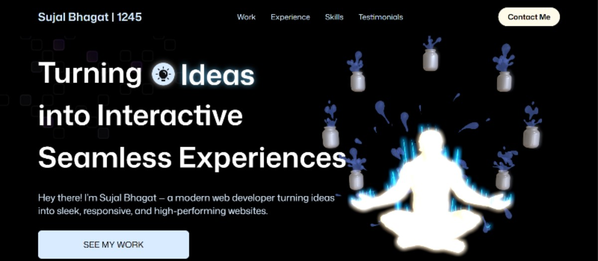
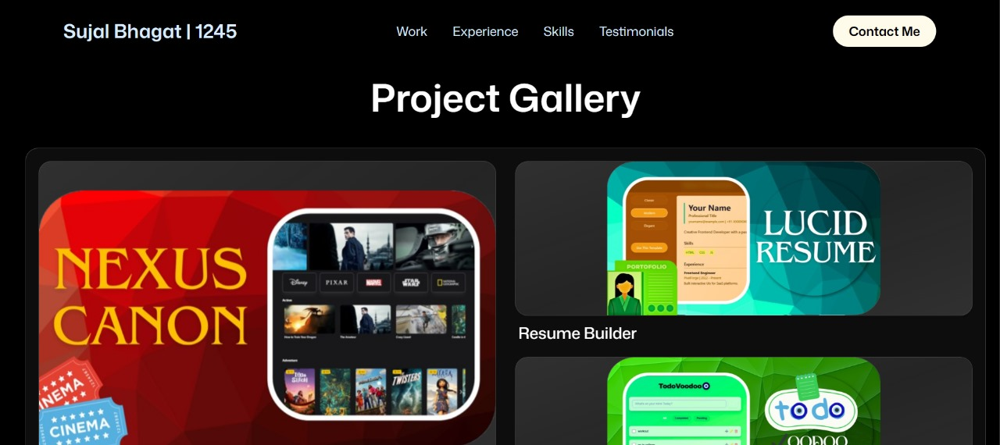
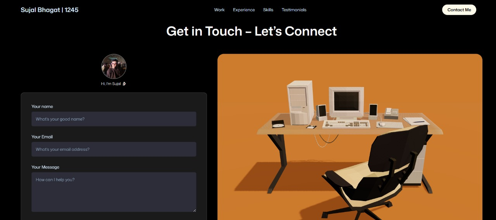

<!-- Banner -->
<h1 align="center">🌐 Sujal Bhagat — Interactive Developer Portfolio</h1>
<p align="center">
  A 3D-powered, animated, and responsive portfolio built to showcase creativity, skill, and code — all in one immersive experience.
</p>

<p align="center">
  <a href="https://sujal-bhagat.vercel.app" target="_blank">
    
  </a>
  <a href="https://github.com/sujal-1245/Sujal-Bhagat-Portfolio" target="_blank">
    
  </a>
</p>

---

## 🖼️ Preview

### 🔥 Hero Section (Animated 3D Entry)



### 💼 Project Showcase (Auto-scroll Slider)



### 📬 Contact Form with Auto-Reply + Custom Toasts



### 🎥 Full Walkthrough Video


https://github.com/user-attachments/assets/e72b8e83-d91e-4bc5-a41d-fa41bbf398b4


---

## ✨ What Makes It Special?

- 🎬 **Custom 3D Loader**: Rotating glowing cube → shatter → swirl portal → 3D reveal  
- 🌀 **Swirl Portal Animation**: Sprite-based FX synced with cube disintegration  
- 🖊️ **Text Reveal**: Line-by-line Hero text animation (Framer Motion)  
- 📽️ **Showcase Slider**: Single-slide, auto-scroll, image/video hover crossfade  
- 💌 **Contact Form**: EmailJS + Auto-reply + Glassy toast confirmation  
- 🌘 **Dark Mode**: Gradient backgrounds & seamless transitions  
- 🧩 **Component-Driven**: Clean, reusable, and scalable codebase

---

## 🧱 Tech Stack

| Category         | Tools Used                                                                 |
|------------------|------------------------------------------------------------------------------|
| ⚛️ Frontend      | React.js, Tailwind CSS, Framer Motion                                       |
| 🌌 3D Graphics    | Three.js, @react-three/fiber, Drei                                          |
| 💌 Messaging      | EmailJS + React Hot Toast                                                   |
| 🎨 Design        | Dark/Light themes, fluid animation, custom shaders                          |
| ⚙️ Deployment     | Vite + Vercel                                                               |

---

## 📁 Project Structure

```bash
Sujal-Bhagat-Portfolio/
│
├── public/
│   ├── swirl_portal.png      # Sprite-based swirl portal
│   └── screens/              # README screenshots
│
├── src/
│   ├── assets/               # Logos, images, and icons
│   ├── components/           # Reusable UI elements (loader, toasts, etc.)
│   ├── sections/             # Hero, Showcase, Contact
│   ├── models/               # 3D cube + R3F setup
│   ├── styles/               # Tailwind + custom themes
│   └── utils/                # Helper functions
````

---

## 🚀 Getting Started

```bash
git clone https://github.com/sujal-1245/Sujal-Bhagat-Portfolio.git
cd Sujal-Bhagat-Portfolio
npm install
npm run dev
```

### 🛠️ EmailJS Setup (`.env`)

```env
VITE_EMAILJS_SERVICE_ID=your_service_id
VITE_EMAILJS_TEMPLATE_ID=your_template_id
VITE_EMAILJS_PUBLIC_KEY=your_public_key
```

---

## 🙋‍♂️ About Me

I'm **Sujal Bhagat**, a full-stack developer passionate about turning ideas into visually-rich, technically-sound experiences.

* 🌍 [Portfolio Website](https://sujal-bhagat.vercel.app)
* 🧑‍💻 [GitHub](https://github.com/sujal-1245)
* 💼 [LinkedIn](https://linkedin.com/in/sujal-bhagat-sdb1245)

---

## 🫶 Show Some Love

If this portfolio inspired you or helped you build your own, feel free to ⭐️ star the repo and connect with me!

---

## 📜 License

This project is open-source and available under the [MIT License](LICENSE).

```


